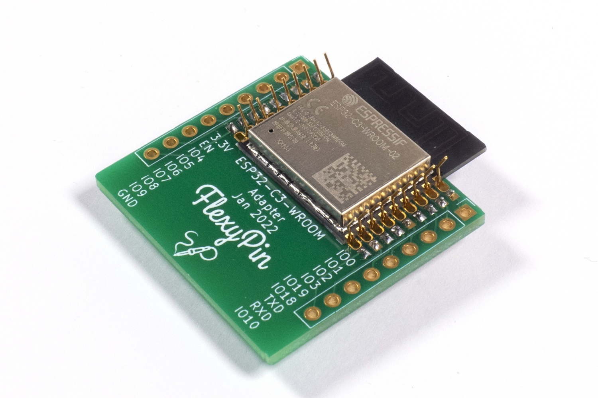
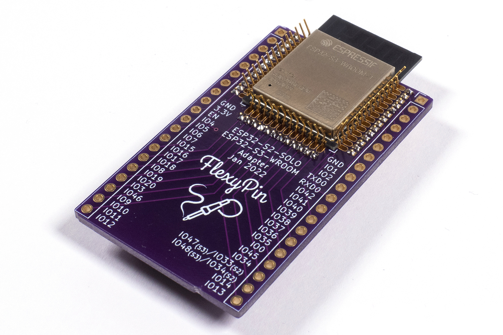
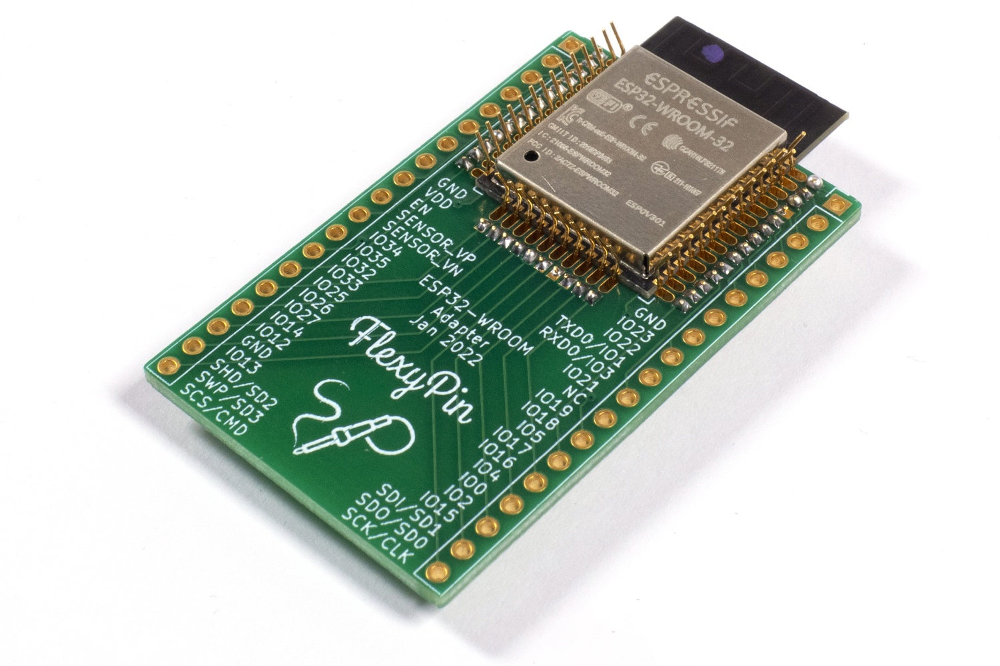
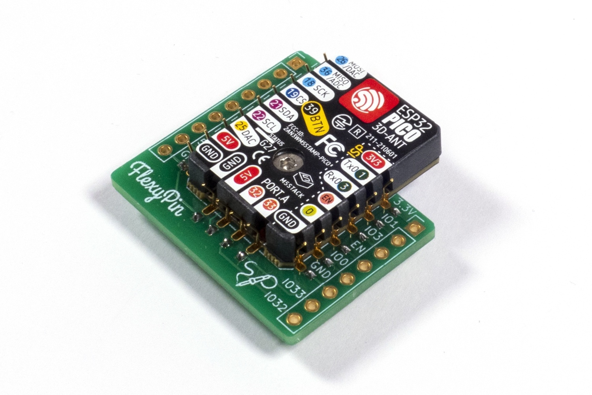
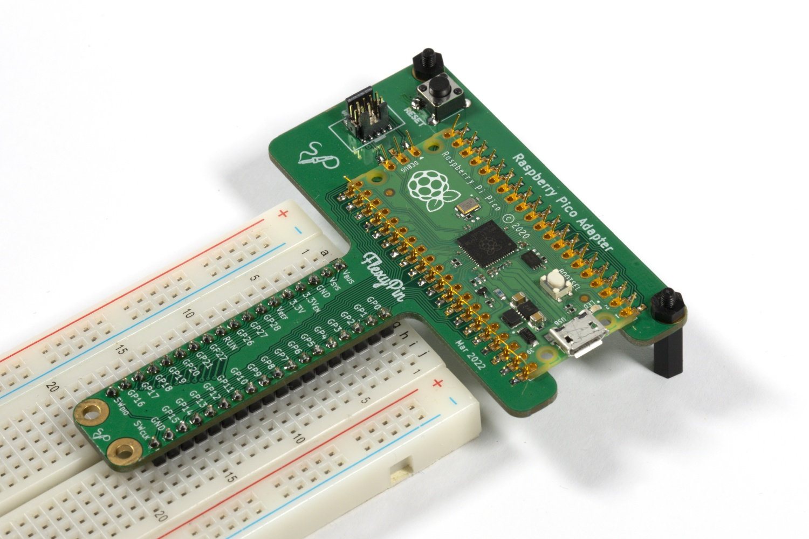
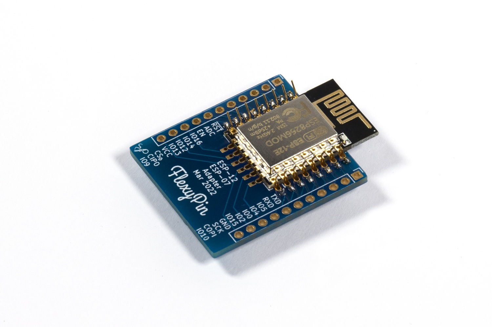
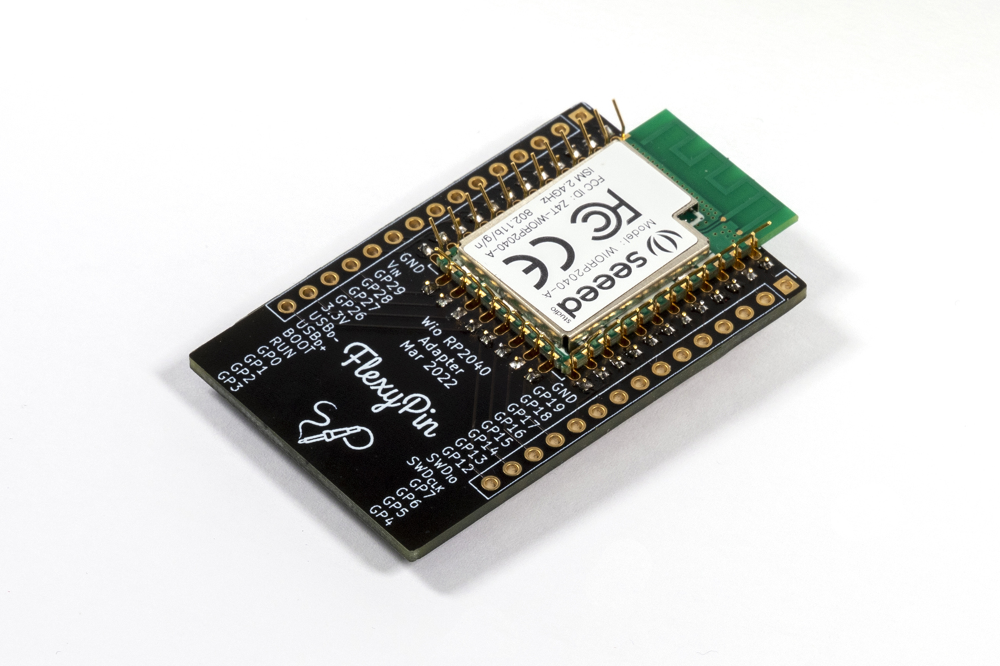

# FlexyPin Adapters

To learn more about FlexyPins, see the dedicated repo here: https://github.com/solderparty/flexypin

This repo contains a collection of open hardware designs for common modules that can be used with FlexyPins.

## ESP32-C3-WROOM

## ESP32-S2-SOLO / ESP32-S3-WROOM

## ESP32-WROOM

## M5Stamp-Pico

## RFM9x

## RaspberryPi Pico

## ESP-12

## WIO RP2040
